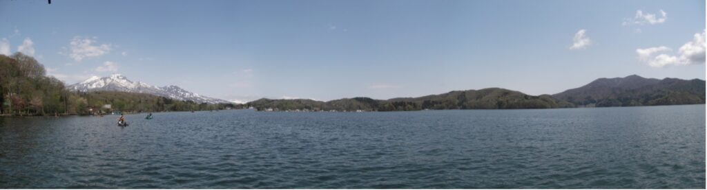

  Annual Conferences
  <h1 style="margin-top: 15px; margin-bottom: 10px; font-size: 2.2em; border: none;">Upcoming 2023 PIE SIG Conferences</h1>
  
"Performance in Education Events Across Japan & Online"

  
  

    <a href="#summer-conference" style="background-color: #0066cc; color: #ffffff; padding: 12px 24px; text-decoration: none; border-radius: 6px; font-weight: bold; box-shadow: 0 2px 4px rgba(0,0,0,0.1);">☀️ Summer Conference</a>
    <a href="#autumn-conference" style="background-color: #28a745; color: #ffffff; padding: 12px 24px; text-decoration: none; border-radius: 6px; font-weight: bold; box-shadow: 0 2px 4px rgba(0,0,0,0.1);">🍁 Autumn Conference</a>
    <a href="#winter-conference" style="background-color: #6c757d; color: #ffffff; padding: 12px 24px; text-decoration: none; border-radius: 6px; font-weight: bold; box-shadow: 0 2px 4px rgba(0,0,0,0.1);">❄️ Winter Conference</a>
  

 

<!-- SUMMER CONFERENCE -->

  <h2 style="margin: 0; color: #004085; border: none;">☀️ Summer Conference</h2>
  Nagano

  

<h3 style="margin-top: 0; color: #1a202c;">Description</h3>

<strong>PIE SIG at Lake Nojiri</strong>

This is the first PIE SIG Conference in the beautiful resort area of Lake Nojiri in northern Nagano. The site of the 3-day conference on Performance in Education is right on the lake.

PIE SIG conferences have always been family-friendly events, and this conference is no exception. The Lake Nojiri area is a place that has everything necessary for a great vacation: impressive natural scenery, interesting sights to see, a variety of family entertainment spots, many good restaurants, and many types of accommodations from top-class hotels to pensions and campgrounds. Come to the conference with your family!

  <strong style="color: #0f172a; font-size: 1.05em;">🗺️ Information on the Lake Nojiri Area:</strong>
  <ul style="margin-top: 10px; margin-bottom: 0; padding-left: 20px;">
    <li><a href="https://shinanomachi-nagano.jp/en/wp/?p=417" target="_blank" style="color: #0066cc;">Shinanomachi Area Guide</a></li>
    <li><a href="https://www.japan-guide.com/ad/lake-nojiri/" target="_blank" style="color: #0066cc;">Japan-Guide: Lake Nojiri</a></li>
    <li><a href="http://myoko-nagano.com/nojiriko/" target="_blank" style="color: #0066cc;">Myoko-Nagano Nojiriko Info</a></li>
    <li><a href="https://www.japan-guide.com/blog/raina/180118.html" target="_blank" style="color: #0066cc;">Japan-Guide Blog: Lake Nojiri</a></li>
    <li><a href="https://www.shinano-machi.com/spot/84" target="_blank" style="color: #0066cc;">Shinano-Machi Sightseeing Spot</a></li>
  </ul>

<h3 style="margin-top: 25px; color: #1a202c;">Site</h3>

The conference will be held at <a href="https://www.nojirilakeresort.jp/" target="_blank" style="color: #0066cc; font-weight: 600;">Nojiri Lake Resort</a> on the shore of Lake Nojiri.

<h3 style="margin-top: 25px; color: #1a202c;">Conference Actions & Resources</h3>

  <a href="https://docs.google.com/forms/d/e/1FAIpQLSfXiED4sWDzn4KC-mBiG6aG0RzlkSCo_NvJhe9jv2Tzz87skQ/viewform" target="_blank" style="border: 1px solid #cbd5e1; padding: 16px; border-radius: 8px; text-decoration: none; color: #1e293b; background: #f8fafc; text-align: center;">
    📝 
    <strong style="display: block; margin-top: 6px;">Call for Papers</strong>
    Submit Proposal
  </a>

  <a href="https://docs.google.com/forms/d/e/1FAIpQLSeVmzGY7q9uGZ4tuX56MS-YOVo5Ir4pr1tLSGJw-qWJ8mkkAg/viewform" target="_blank" style="border: 1px solid #cbd5e1; padding: 16px; border-radius: 8px; text-decoration: none; color: #1e293b; background: #f8fafc; text-align: center;">
    🎟️ 
    <strong style="display: block; margin-top: 6px;">Registration</strong>
    Register Online
  </a>

  <a href="https://docs.google.com/spreadsheets/d/1DvuN_mb-NaY-Z3jPyEHglIi-MKyzxtCliWEWiaxC5QI/edit#gid=0" target="_blank" style="border: 1px solid #cbd5e1; padding: 16px; border-radius: 8px; text-decoration: none; color: #1e293b; background: #f8fafc; text-align: center;">
    📅 
    <strong style="display: block; margin-top: 6px;">Schedule</strong>
    View Spreadsheet
  </a>

  <a href="https://padlet.com/jaltpiesig/jalt_pie_sig_padlet" target="_blank" style="border: 1px solid #cbd5e1; padding: 16px; border-radius: 8px; text-decoration: none; color: #1e293b; background: #f8fafc; text-align: center;">
    📁 
    <strong style="display: block; margin-top: 6px;">Resources & Review</strong>
    Padlet Archive
  </a>

 

<!-- AUTUMN CONFERENCE -->

  <h2 style="margin: 0; color: #004085; border: none;">🍁 Autumn Conference</h2>
  Nagoya

  

  Dates
  
Friday, 20 October 2023 – Sunday, 22 October 2023

<h3 style="margin-top: 0; color: #1a202c;">Description</h3>

<strong>PIE SIG in Nagoya</strong>

The PIE SIG Autumn Conference will be held from Friday, 20 October 2023 to Sunday, 22 October 2023 in Nagoya. Nagoya is centrally located and has a wide variety of hotels, restaurants, and sightseeing spots.

<h3 style="margin-top: 25px; color: #1a202c;">Site</h3>

<a href="https://www.city.nagoya.jp/kyoiku/page/0000051934.html" target="_blank" style="color: #0066cc; font-weight: 600;">Nakamura Lifelong Learning Center</a> 
The conference site is near Honjin Station (Exit 4), close to shopping areas, sightseeing spots, and hotels.

  

<h3 style="margin-top: 25px; color: #1a202c;">Conference Actions & Resources</h3>

  <a href="https://docs.google.com/forms/d/e/1FAIpQLSefFwTnL4edNL_7dXjikenrVVlkXlWibFtbndhiCwXl7XfkhA/viewform" target="_blank" style="border: 1px solid #cbd5e1; padding: 16px; border-radius: 8px; text-decoration: none; color: #1e293b; background: #f8fafc; text-align: center;">
    📝 
    <strong style="display: block; margin-top: 6px;">Call for Papers</strong>
    Submit Proposal
  </a>

  <a href="https://docs.google.com/forms/d/e/1FAIpQLSdTxZV7XwB0-x-bryiUn_wnA6dIowVgrGljgoBElDnia8x5xA/viewform" target="_blank" style="border: 1px solid #cbd5e1; padding: 16px; border-radius: 8px; text-decoration: none; color: #1e293b; background: #f8fafc; text-align: center;">
    🎟️ 
    <strong style="display: block; margin-top: 6px;">Registration</strong>
    Register Online
  </a>

  <a href="https://docs.google.com/spreadsheets/d/1IGRRfAPgye6YReCzHUMXfofQpsm43xYXz3-mzU9nU2Y/edit#gid=0" target="_blank" style="border: 1px solid #cbd5e1; padding: 16px; border-radius: 8px; text-decoration: none; color: #1e293b; background: #f8fafc; text-align: center;">
    📅 
    <strong style="display: block; margin-top: 6px;">Schedule</strong>
    View Spreadsheet
  </a>

  <a href="https://padlet.com/jaltpiesig/jalt_pie_sig_padlet" target="_blank" style="border: 1px solid #cbd5e1; padding: 16px; border-radius: 8px; text-decoration: none; color: #1e293b; background: #f8fafc; text-align: center;">
    📁 
    <strong style="display: block; margin-top: 6px;">Resources & Review</strong>
    Padlet Archive
  </a>

 

<!-- WINTER CONFERENCE -->

  <h2 style="margin: 0; color: #004085; border: none;">❄️ Winter Conference</h2>
  Online (Zoom)

  

<h3 style="margin-top: 0; color: #1a202c;">Description</h3>

<strong>PIE SIG ON ZOOM</strong> 
This is an entirely online conference.

<h3 style="margin-top: 25px; color: #1a202c;">Conference Actions & Resources</h3>

  <a href="https://docs.google.com/forms/d/e/1FAIpQLSfiYFUBai0X-N-CIrKMBL2b-o52DQf4Cfo8QQj6AfZPV4wVig/viewform" target="_blank" style="border: 1px solid #cbd5e1; padding: 16px; border-radius: 8px; text-decoration: none; color: #1e293b; background: #f8fafc; text-align: center;">
    📝 
    <strong style="display: block; margin-top: 6px;">Call for Papers</strong>
    Submit Proposal
  </a>

  <a href="https://docs.google.com/forms/d/e/1FAIpQLSd3tCLX9gKMI7MFMHiwY9nFIp0sKwR-IFSiq6z-2OTLfyrx2w/viewform" target="_blank" style="border: 1px solid #cbd5e1; padding: 16px; border-radius: 8px; text-decoration: none; color: #1e293b; background: #f8fafc; text-align: center;">
    🎟️ 
    <strong style="display: block; margin-top: 6px;">Registration</strong>
    Register Online
  </a>

  <a href="https://docs.google.com/spreadsheets/d/1pf-XdVctLuq89kSiNr1P9kAnWKoMqVcbsGiut3RBoI4/edit#gid=0" target="_blank" style="border: 1px solid #cbd5e1; padding: 16px; border-radius: 8px; text-decoration: none; color: #1e293b; background: #f8fafc; text-align: center;">
    📅 
    <strong style="display: block; margin-top: 6px;">Schedule</strong>
    View Spreadsheet
  </a>

  <a href="https://padlet.com/jaltpiesig/jalt_pie_sig_padlet" target="_blank" style="border: 1px solid #cbd5e1; padding: 16px; border-radius: 8px; text-decoration: none; color: #1e293b; background: #f8fafc; text-align: center;">
    📁 
    <strong style="display: block; margin-top: 6px;">Resources & Review</strong>
    Padlet Archive
  </a>

