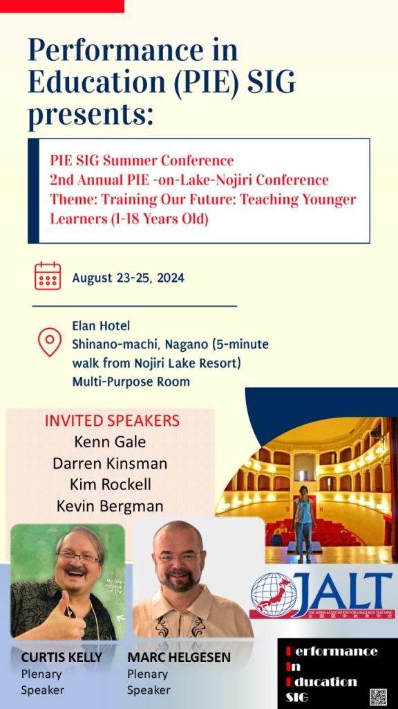
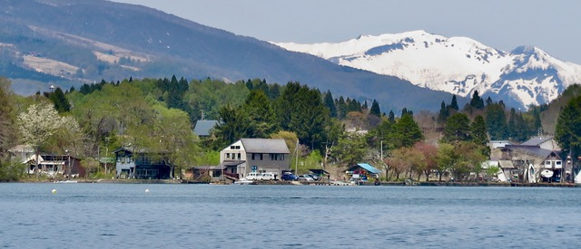
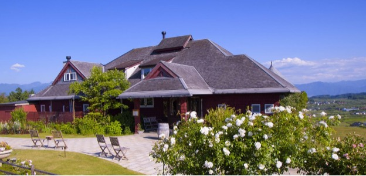
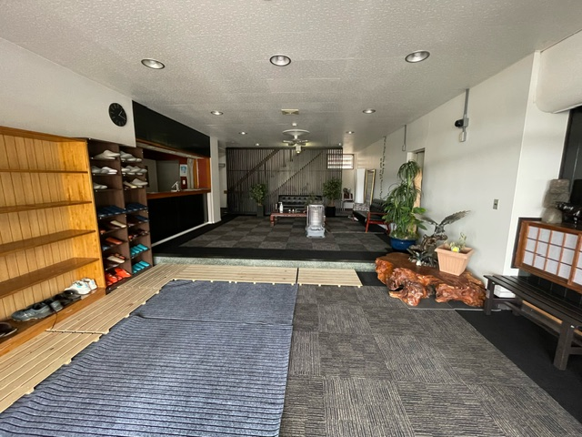
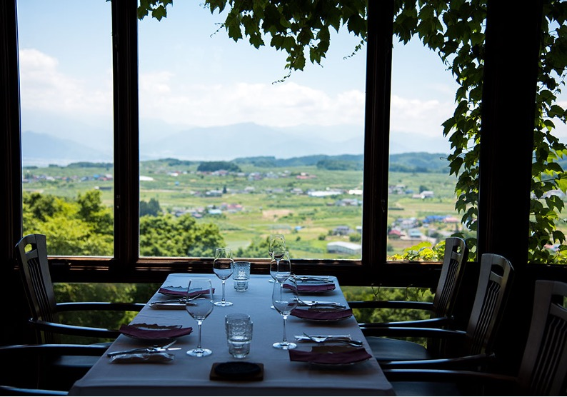
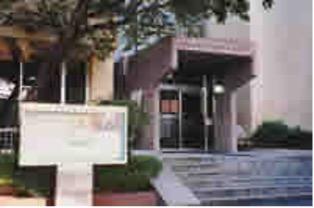

[Spring Conference](#spring) - [Summer Conference](#summer) - [Autumn Conference](#autumn)

## PIE SIG Spring Conference

### 2nd Annual FREE-PIE-on-Zoom Conference: Recipes for PIE 2 2024

Site: Zoom (link to be provided later)  
Theme: Recipes for PIE 2  
Date: February 2025  
(TBA): Practice for presenters on Zoom

[Click here for Call for Submissions](https://docs.google.com/forms/d/e/1FAIpQLSez9U9NaSYKurW7ZlPduWf6g3L8YkFTxBDfEbqLa2GcRc53hg/viewform)

[Click here for Registration](https://docs.google.com/forms/d/e/1FAIpQLSertHksZNkisPRuTB42iZxz17CTYVULiUMHRBrO3QaYY42LLQ/viewform)

[Click here for the Schedule](https://docs.google.com/spreadsheets/d/1OaWxzpwqswlya021Cqc0Tu_U8sJHXrINRFv7FQj0l4c/edit#gid=2028530058)

### **Description**

This conference will build on the first Recipes for PIE held on March 16, 2024 as part of the 2023 academic year. Most presentations will be 25-minute descriptions of PIE activities with a few workshops and performances.

* * *

## PIE SIG Summer Conference

###  2nd Annual PIE-on-Lake-Nojiri Conference

### **Description**

JALT PIE SIG, with cooperation and support from the Okinawa Chapter of JALT, the Niigata Chapter of JALT, and JALT CALL SIG, and with assistance from the Teaching Young Learners and the Nagano Chapter of JALT, are proud to sponsor the PIE SIG Summer Conference 2024, to be held 23-25 August 2024 on Lake Nojiri in Nagano.

Dates: August 23-25, 2024  
Theme: Training Our Future: Teaching Younger Learners (1-18 Years Old)  
Site: [Elan Hotel](https://www.elanescapes.com/elanhotelnojiri), Shinano-machi, Nagano (5-minute walk from Nojiri Lake Resort) Multi-Purpose Room

[Call for Submissions](https://docs.google.com/forms/d/e/1FAIpQLSfheAXMeB7dyvT-PXtv6U008v5pVp3bAxiemcZddC2TuzsB2w/viewform)

[Registration](https://docs.google.com/forms/d/e/1FAIpQLSe_Kqg2zU-g4BNyf64KSOfhe3HxPOgr1HvzWjd-3L65ubZCVw/viewform)  
(5,000 JPN Yen for JALT members; 7,000 JPN Yen for non-JALT members)

[Schedule](https://docs.google.com/spreadsheets/d/1i1JGDJpeemYAmteDPO8U8m9bjcywQNej_XVyk7U6edo/edit#gid=0)

August 23, 2024 (Friday): Officers Planning Meeting, Cultural Event ([“Kurohime _Dowa-kan_” Kurohime Museum of Fairytales](https://douwakan.com/), includes folktales of the region, Networking Event

August 24, 2024 (Saturday): 9:00 Registration, 10:00-17:00 Presentations, 6:30-8:30 Networking Dinner: [St. Cousair Winery Restaurant](https://www.stcousair.co.jp/valley/restaurant) 

August 25, 2024 (Sunday): 9:00-12:00 Presentations, 12:00-12:30 Clean-up, 12:30-13:30 Lunch, 13:30-17:30 Officers Evaluation and Planning Meeting

Come to lovely [Lake Nojiri in northern Nagano](https://www.top-rated.online/countries/Japan/cities/Shinano/all/our-rank) to enjoy beautiful nature and the fruits of the field and vineyard!

* * *

## PIE SIG Autumn Conference

### 2nd Annual PIE-in-Nagoya Conference, with the Nagoya and Gifu Chapter of JALT

Performance in Education activities can be special presents for our students to help them celebrate any occasion, be it a holiday or the end of a unit. Help us prepare to belatedly commemorate Halloween, Thanksgiving, Christmas, New Year’s . . . or even the end of a unit or semester! Come share your celebratory activities and performances.

**Conference Date:** 30 November to 1 December

**Conference Theme:** PIE for Every Occasion

**PIE Activities:** Speech, presentation, drama, debate, etc. for either normal occasions like a class or school festival or special occasions like Halloween, Thanksgiving, Christmas, Tanabata, etc

**Conference Venue:** [Moriyama Life-long Learning Center](https://www.city.nagoya.jp/kyoiku/page/0000051823.html)

[Call for Submissions](https://docs.google.com/forms/d/e/1FAIpQLSdqJOtrn2OLV_f4JQ5HXe1ufGieK0bb2ny4Bm6_aKsR5AML-A/viewform)

[Registration](https://docs.google.com/forms/d/e/1FAIpQLScXonlB5V2_5hPHaWLxMdCoe3UZ2fizbDBAJ7_zlNDJQFuaOg/viewform)

[Schedule](https://docs.google.com/spreadsheets/d/1gw4RHXZaAZxtNS8zrlvSlKNaznyDSyEpkpHB4Itk_kc/edit#gid=2028530058)

**Day 1 (Friday evening, 29 November):** Officers Planning Meeting, Networking Event open to all

**Day 2 (Saturday, 30 November):** 9:00 Registration, 10:00-17:00 Presentations, 6:30-8:30 Networking Dinner: [St. Marc Bakery and Restaurant (Owariasahi)](https://www.saint-marc-hd.com/saintmarc/shop/73/)

**2nd Party (after Networking Dinner, 30 November):** [Ryusenji no Yu Supersento Sauna and Hot Spring Baths](https://www.ryusenjinoyu.com/moriyama/)

**Day 3 (Sunday, 1 December)**: 10:00-15:30 Presentations, 15:30-16:30 Clean-up, 17:30 Networking/Officers Evaluation and Planning Meeting
