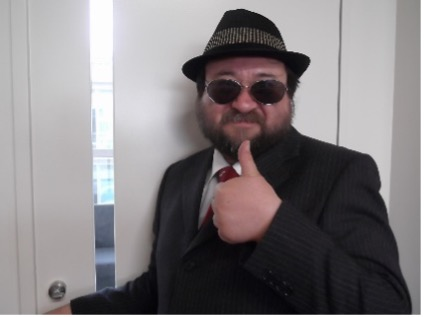

##  2nd Annual PIE-on-Lake-Nojiri Conference

* * *

### **Description**

JALT PIE SIG, with cooperation and support from the Okinawa Chapter of JALT, the Niigata Chapter of JALT, and JALT CALL SIG, and with assistance from the Teaching Young Learners and the Nagano Chapter of JALT, are proud to sponsor the PIE SIG Summer Conference 2024, to be held 23-25 August 2024 on Lake Nojiri in Nagano.

The theme of the conference is “Training Our Future: Teaching Younger Learners (0-18 Years Old).” The primary focus of this conference will be on the teaching of performance activities to children from nursery school to high school. Performances are welcome. Of course, presentations on general PIE activities, research, and performances also are welcome!

Come to lovely [Lake Nojiri in northern Nagano](https://www.top-rated.online/countries/Japan/cities/Shinano/all/our-rank) to enjoy beautiful nature and the fruits of the field and vineyard!

* * *

### Registration & Information

**Dates**: August 23-25, 2024  
**Theme**: Training Our Future: Teaching Younger Learners (1-18 Years Old)  
**Site**: [Elan Hotel](https://www.elanescapes.com/elanhotelnojiri), Shinano-machi, Nagano (5-minute walk from Nojiri Lake Resort) Multi-Purpose Room

[Call for Submissions](https://docs.google.com/forms/d/e/1FAIpQLSfheAXMeB7dyvT-PXtv6U008v5pVp3bAxiemcZddC2TuzsB2w/viewform)

[Registration](https://docs.google.com/forms/d/e/1FAIpQLSe_Kqg2zU-g4BNyf64KSOfhe3HxPOgr1HvzWjd-3L65ubZCVw/viewform)  
(5,000 JPN Yen for JALT members; 7,000 JPN Yen for non-JALT members)

* * *

### Schedule

[Link to live schedule](https://docs.google.com/spreadsheets/d/1i1JGDJpeemYAmteDPO8U8m9bjcywQNej_XVyk7U6edo/edit#gid=0)

#### August 23, 2024 (Friday)

Officers Planning Meeting

Cultural Event ([“Kurohime _Dowa-kan_” Kurohime Museum of Fairytales](https://douwakan.com/), includes folktales of the region)

Networking Event

#### August 24, 2024 (Saturday)

9:00 Registration

10:00-17:00 Presentations

18:30-20:30 Networking Dinner: [St. Cousair Winery Restaurant](https://www.stcousair.co.jp/valley/restaurant) 

#### August 25, 2024 (Sunday)

9:00-12:00 Presentations

12:00-12:30 Clean-up

12:30-13:30 Lunch

13:30-17:30 Officers Evaluation and Planning Meeting

* * *

### Invited Speaker

#### Kenn Gale (Vice President of JALT)

Principal and Director of No Borders International School. One of the largest private Pre/Kinder schools in Japan. Over 180 staff and 600 fulltime students and over 1,000 part-time students. Kenn and his wife and 3 kids live in Nagoya where he also owns a small Montessori kindergarten. He is the Vice President of JALT, the President of Tokyo Association of International Preschool, and President of the Tokai International School Association.

* * *

### Plenary Speakers

#### Curtis Kelly (Kansai University, Professor Emeritus)

Speaker and writer, Curtis Kelly (EdD), has lived most of his life in Japan and is a Professor Emeritus of Kansai University. He completed an extended research project with the Ministry of Education on planning an e-learning system to train elementary school teachers how to teach English to children. He also trains college students how to teach English to children and has set up numerous cooperative programs between universities and elementary schools. He once set up a MEXT-funded First Nations English study camp for children in Adogawa-cho, Shiga.

In addition to having written 35 books, he has given over 500 presentations around the world, most on the neuroscience of learning. He produces the MindBrainEd Think Tanks, a monthly magazine connecting brain science to language teaching. His life mission is “to relieve the suffering of the classroom.”

#### Marc Helgesen (Miyagi Gakuin Women's University)

Hi.  I'm Marc Helgesen.  I'm a professor in the **[Department of Modern Business](http://www.mgu.ac.jp/main/departments/bussiness/bz/index.html)** at **[Miyagi Gakuin Women's University](http://www.mgu.ac.jp/)**, Sendai, Japan. I also teach at **[Nagoya University of Foreign Studies MA TESOL Program](http://www.nufs.ac.jp/feature/teaching_method/index.html)** where I teach a course on "**[Positive Psychology in ELT](http://www.eltandhappiness.com/)**."

I'm an author of several books including the _**[English Firsthand](https://www.pearsonelt.com/catalogue/general-english/english-firsthand.html)**_ series from Pearson Education. Also, _[**ELT & the Science of Happiness:** Positive psychology activities for language learners](http://abax.co.jp/newsdetail.php?id=29)_ from ABAX.

I'm very interested in Extensive Reading and am the past chair of the **[Extensive Reading Foundation](http://erfoundation.org/)** which, among other things, organizes the **[Language Learner Literature Awards](http://erfoundation.org/wordpress/?page_id=1071)** each year for the best graded readers. 

Other academic interests include connecting **[ELT (English Language Teaching) to Positive Psychology](http://www.eltandhappiness.com/)** and **[NeuroELT](http://helgesenhandouts.weebly.com/diy-neuro-elt.html)** (Brain Science in ELT).  In addition to my own NeuroELT pages, here are links to the **[JALT BRAIN SIG](https://www.facebook.com/mindbrained?ref=aymt_homepage_panel)** and **[FAB](http://fab-efl.com/)**, an organization that organizes NeuroELT conferences.

* * *

### Saturday Presentations

#### The Impact of Roleplay and Performance-Based Education: An Outsider's Perspective  
Kenn Gale

Having not been a teacher in over 10 years, I often forget some of the methods and tools that I once used to captivate and influence my students. However, as a principal, I often have the chance to walk around and observe the teaching staff. And, speaking for the younger learners age range, I can confidently say that the power of acting, physicality, role play and imagination is by far the most powerful weapon in my teachers arsenal. When these methods are introduced, it is obvious the attention and retention of the students increase and learning takes place in a much more entertaining and efficient means.

#### **Why our Brains Love Stories**  
Curtis Kelly

Stories, the original Wikipedia, are the oldest tool of teaching, and still the most potent. For most of human existence, we have used stories to share information and educate our offspring about the wiles of the world. It is no wonder our brains have evolved to process stories so much more effectively than other formats of delivery. In fact, we tend to learn information delivered by stories twice as quickly and remember it twice as long as the same information delivered by explanation. The presenter will provide the neuroscience behind stories, methods for using them, and ask the participants to find ways to incorporate them in their teaching.

#### Reading Aloud with a Purpose   
Marc Helgesen

Reading aloud is common in classrooms worldwide. But the purpose is often dubious. Often the reality is “choral mumbling” or “one person reads while others wait for him or her to make a mistake.” Questionable. And yet, there are practical, meaningful reasons to have students read aloud: chunking, focused listening, giving clues about comprehension. It can even be engaging. This session will introduce 10 ways for purposeful oral reading. They include 1. _read and recall, 2. contrasting silent and oral reading, 3. chunks and phrasing, 4. catching word/syllable stress, 5. focus on rhythm, 6. read and look up, 7. read and look up with shadowing,  8. DIY catch the mistakes, 9. reading with emotion,_ and 10. _peer reading._ The sample text will be from a Japanese high school textbook. A handout showing ways that nearly any text can be modified for purposeful oral reading will be provided. All of the strategies take little or no time to prepare.

* * *

### Sunday Presentations

#### **Presentation Design 101**  
Marc Helgesen

We’ve all seen many – probably hundreds – of presentations, many designed by other teachers. We assume the presenters know their content well. A good presentation slide show is visual. How many of those presenters have ever learned about slide design? Most seem to model their slides on session they’ve seen. Real design input? What’s that? This session will introduce eight simple slide design ideas, takeaways from the bestselling Presentation Zen. Whether you are using PowerPoint or Keynote, these ideas apply and are easy to incorporate. They include the picture superiority effect (great, but whether or not you have a budget makes a difference.) A lot of slide shows are great – for people in the first couple rows. What about everyone else? How about the pros -and especially the cons of slide animation? Your slideware has dozens of backgrounds. Why should you be careful with most of them? Bullet points are automatic. Do you really want to use them? One idea = one slide.

#### **Since Language Is Embodied, Drama Is Brain-Compatible**  
Curtis Kelly

We teach the brain. But what most people do not realize is that the brain is not a separate entity in your head; it extends through the entire body where is does this dance with other organs. In fact, everything we know, including language, came to us first through the body. Words are defined in sensory and motor routines, the same ones we use when doing or seeing the related actions. Even when sitting and learning words, your brain is activating related sensory-motor neural routines. This is why drama, that connects visual, auditory, tactile, emotional, and cues to language is so effective in teaching it. Drama, unlike many other approaches, is brain-compatible. So, congratulations! What you knew intuitively about the power of drama is asserted through neuroscience.

* * *

### **Welcome from Kenn Gale, Vice President of JALT**

Greetings!

First of all, let me say that it is truly a pleasure to be invited to this event and I look forward to networking with you all and participating in great presentations.  I can speak not only as a member of JALT but being on the Board of Directors for over 6 years now that I/we are so happy with our Chapters and SIGs that are active and providing great content and support for our members like the PIE SIG does.  This particular event is very exciting for me specifically because it deals in the area of younger learners. 

So, once again, see you all soon, and thank you to the PIE SIG leadership team for all the hard work and effort that is put into these events, this is what JALT is all about and the very reason why I am so proud to work with all of you!

Kenn Gale  
Vice President  
The Japan Association for Language Teaching (JALT)

* * *

### **Welcome from the Conference Chair**

Whitney Houston sang: 

> I believe that children are our future  
> Teach them well and let them lead the way  
> Show them all the beauty they possess inside  
> Give them a sense of pride and make it easier  
> Let the children’s laughter remind us how we used to be"

As the proud father of a wonderful daughter, I sincerely believe these words. I also believe the teachers of children are the foundation of our profession in general and the Performance in Education SIG in particular. If we introduce performance activities to students when they are young, “give them a sense of pride,” then teaching PIE activities to our university students will be much easier. They will see their intrinsic value.

What has given me a sense of awe and inspiration is to listen to Kevin Bergman in his quiet, calm voice tell of how he does full-length Shakespeare plays like _King Lear_ and _King Henry IV_—both in the same year—with high school students—and they liked it! AND he writes the scripts (adapted from the original plays) and directs the productions. And he has done this for many years! Respect.

If he can do this, then so can we. Or, at least we can try. Or, we can do other PIE activities like roleplays, readers theater, oral interpretation, speech, debate, “etc., etc., and so forth.” And who knows? Perhaps some day in the future, some of our students will become teachers and will share with THEIR students the treasure trove of PIE activities, and maybe even add to the mountain of treasure themselves.

David Kluge  
President  
Performance in Education SIG  

