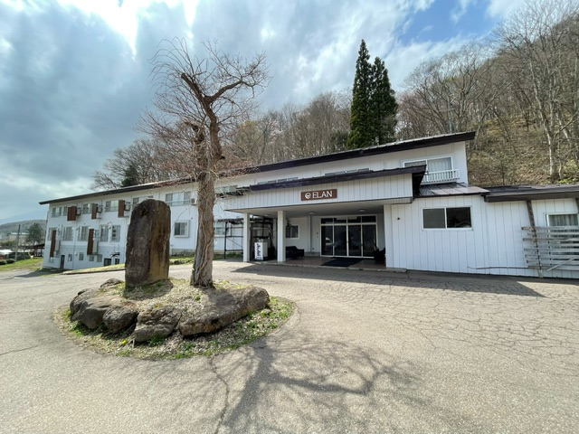
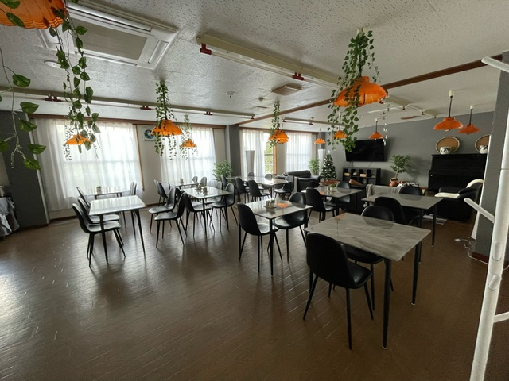
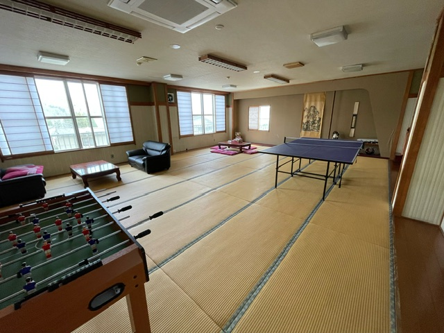
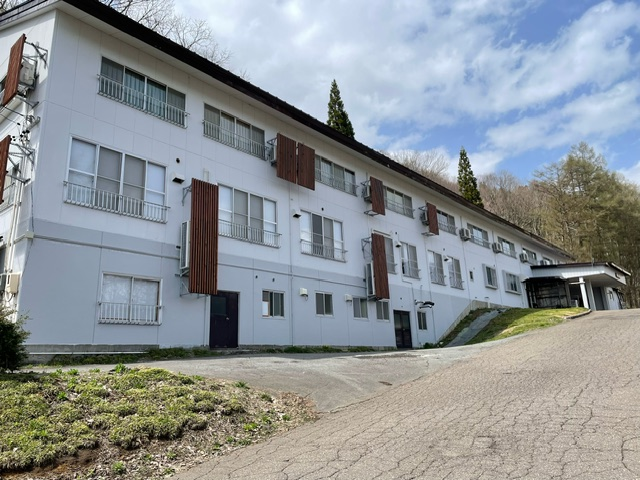
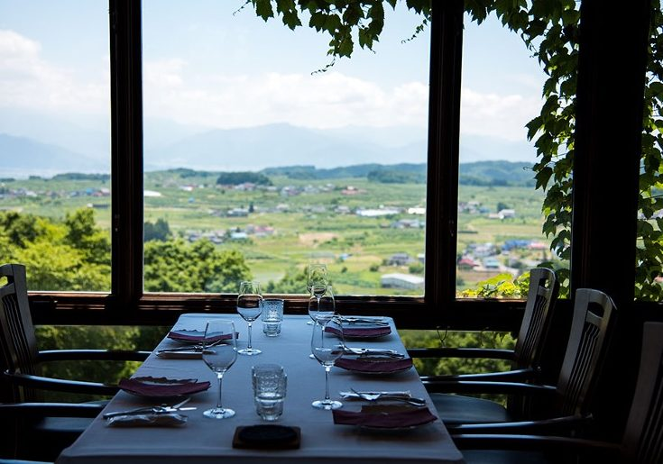
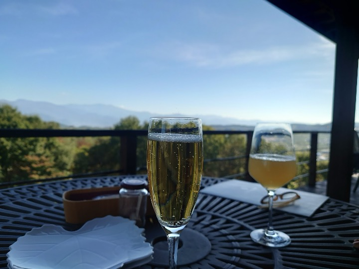
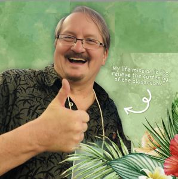

  Summer Event
  <h1 style="margin-top: 15px; margin-bottom: 10px; font-size: 2.2em; border: none;">2nd Annual PIE-on-Lake-Nojiri Conference</h1>
  
"Training Our Future: Teaching Younger Learners (0–18 Years Old)"

  
  

    <a href="https://docs.google.com/forms/d/e/1FAIpQLSe_Kqg2zU-g4BNyf64KSOfhe3HxPOgr1HvzWjd-3L65ubZCVw/viewform" target="_blank" style="background-color: #0066cc; color: #ffffff; padding: 12px 24px; text-decoration: none; border-radius: 6px; font-weight: bold; box-shadow: 0 2px 4px rgba(0,0,0,0.1);">🎟️ Register for Conference</a>
    <a href="https://docs.google.com/forms/d/e/1FAIpQLSfheAXMeB7dyvT-PXtv6U008v5pVp3bAxiemcZddC2TuzsB2w/viewform" target="_blank" style="background-color: #28a745; color: #ffffff; padding: 12px 24px; text-decoration: none; border-radius: 6px; font-weight: bold; box-shadow: 0 2px 4px rgba(0,0,0,0.1);">📝 Submit Proposal</a>
  

 

  

<!-- CONFERENCE AT A GLANCE (Card Grid Layout) -->

<h3 style="margin-top: 0; margin-bottom: 25px; color: #004085; border-bottom: 2px solid #e6f2ff; padding-bottom: 10px;">📌 Conference at a Glance</h3>

  

    Dates
    
August 23–25, 2024

    Friday through Sunday
  

  

    Location
    
Lake Nojiri, Nagano

    <a href="https://www.elanescapes.com/elanhotelnojiri" target="_blank" style="font-size: 0.85em; color: #0066cc;">Elan Hotel Multi-Purpose Room →</a>
  

  

    Invited Speaker
    
Kenn Gale

    Vice President of JALT
  

  

    Plenary Speakers
    
Curtis Kelly & Marc Helgesen

    NeuroELT & ELT Experts
  

  Co-Sponsors & Supporters:
  
    Okinawa JALT
    Niigata JALT
    Nagano JALT
    JALT CALL SIG
    Teaching Young Learners SIG
  

 

<!-- DESCRIPTION & GALLERY -->

<h3 style="margin-top: 0; color: #1a202c; border-bottom: 2px solid #edf2f7; padding-bottom: 10px;">📖 About the Conference</h3>

JALT PIE SIG, with cooperation and support from the Okinawa Chapter of JALT, the Niigata Chapter of JALT, and JALT CALL SIG, and with assistance from Teaching Young Learners and the Nagano Chapter of JALT, are proud to sponsor the <strong>PIE SIG Summer Conference 2024</strong>, held on Lake Nojiri in Nagano.

The theme of the conference is <strong>“Training Our Future: Teaching Younger Learners (0–18 Years Old).”</strong> The primary focus of this conference is on the teaching of performance activities to children from nursery school to high school. Performances, general PIE activities, research, and interactive presentations are all featured!

  
  
  
  
  

Come to lovely <a href="https://www.top-rated.online/countries/Japan/cities/Shinano/all/our-rank" target="_blank" style="color: #0066cc; font-weight: 600;">Lake Nojiri in northern Nagano</a> to enjoy beautiful nature and the fruits of the field and vineyard!

  
  

 

<!-- REGISTRATION & FEES -->

<h3 style="margin-top: 0; color: #1a202c; border-bottom: 2px solid #edf2f7; padding-bottom: 10px;">🎟️ Registration & Attendance Fees</h3>

  
  

    
<strong>Venue:</strong> <a href="https://www.elanescapes.com/elanhotelnojiri" target="_blank" style="color: #0066cc;">Elan Hotel Multi-Purpose Room</a>, Shinano-machi, Nagano (5-minute walk from Nojiri Lake Resort).

    
Join us for three days of inspiring sessions, collaborative workshops, and social networking right on the lake.

  

  

    JALT Members
    
¥5,000

    Full Access
  

  

    Non-Members
    
¥7,000

    General Admission
  

  <a href="https://docs.google.com/forms/d/e/1FAIpQLSe_Kqg2zU-g4BNyf64KSOfhe3HxPOgr1HvzWjd-3L65ubZCVw/viewform" target="_blank" style="border: 1px solid #cbd5e1; padding: 18px; border-radius: 8px; text-decoration: none; color: #1e293b; background: #f8fafc; flex: 1; min-width: 220px; text-align: center;">
    🎟️ 
    <strong style="display: block; margin-top: 8px;">Registration Form</strong>
  </a>
  
  <a href="https://docs.google.com/forms/d/e/1FAIpQLSfheAXMeB7dyvT-PXtv6U008v5pVp3bAxiemcZddC2TuzsB2w/viewform" target="_blank" style="border: 1px solid #cbd5e1; padding: 18px; border-radius: 8px; text-decoration: none; color: #1e293b; background: #f8fafc; flex: 1; min-width: 220px; text-align: center;">
    📝 
    <strong style="display: block; margin-top: 8px;">Call for Submissions</strong>
  </a>

 

<!-- SCHEDULE CARD -->

<h3 style="margin-top: 0; color: #1a202c; border-bottom: 2px solid #edf2f7; padding-bottom: 10px;">📅 Program Schedule</h3>

  <a href="https://docs.google.com/spreadsheets/d/1i1JGDJpeemYAmteDPO8U8m9bjcywQNej_XVyk7U6edo/edit#gid=0" target="_blank" style="background-color: #0066cc; color: #ffffff; padding: 8px 16px; border-radius: 6px; text-decoration: none; font-weight: bold; font-size: 0.9em; display: inline-block;">📊 View Live Interactive Schedule Spreadsheet</a>

  

    <strong style="color: #0066cc; font-size: 1.1em;">August 23, 2024 (Friday)</strong>
    <ul style="margin-top: 8px; margin-bottom: 0; padding-left: 20px;">
      <li>Officers Planning Meeting</li>
      <li>Cultural Event at <a href="https://douwakan.com/" target="_blank" style="color: #0066cc;">Kurohime Museum of Fairytales (Dowa-kan)</a>, featuring local folktales</li>
      <li>Networking Event</li>
    </ul>
  

  

    <strong style="color: #28a745; font-size: 1.1em;">August 24, 2024 (Saturday)</strong>
    <ul style="margin-top: 8px; margin-bottom: 12px; padding-left: 20px;">
      <li>09:00 — Registration</li>
      <li>10:00–17:00 — Presentations</li>
      <li>18:30–20:30 — Networking Dinner at <a href="https://www.stcousair.co.jp/valley/restaurant" target="_blank" style="color: #0066cc;">St. Cousair Winery Restaurant</a></li>
    </ul>
    
  

  

    <strong style="color: #475569; font-size: 1.1em;">August 25, 2024 (Sunday)</strong>
    <ul style="margin-top: 8px; margin-bottom: 0; padding-left: 20px;">
      <li>09:00–12:00 — Presentations</li>
      <li>12:00–12:30 — Clean-up</li>
      <li>12:30–13:30 — Lunch</li>
      <li>13:30–17:30 — Officers Evaluation and Planning Meeting</li>
    </ul>
  

 

<!-- SPEAKERS SECTION -->

<h3 style="margin-top: 0; color: #1a202c; border-bottom: 2px solid #edf2f7; padding-bottom: 10px;">🎤 Keynote & Plenary Speakers</h3>

<!-- INVITATION SPEAKER -->

  
  

    Invited Speaker
    <h4 style="margin: 6px 0 4px 0; color: #0f172a; font-size: 1.2em;">Kenn Gale</h4>
    
Vice President of JALT

    
Principal and Director of No Borders International School, one of the largest private Pre/Kinder schools in Japan (serving over 1,800 full-time and part-time students). Kenn lives in Nagoya where he also owns a small Montessori kindergarten. He serves as Vice President of JALT, President of Tokyo Association of International Preschool, and President of the Tokai International School Association.

  

<!-- PLENARY SPEAKER 1 -->

  
  

    Plenary Speaker
    <h4 style="margin: 6px 0 4px 0; color: #0f172a; font-size: 1.2em;">Curtis Kelly, Ed.D.</h4>
    
Kansai University, Professor Emeritus

    
Speaker and author Curtis Kelly has given over 500 presentations worldwide, primarily on the neuroscience of learning. He has authored 35 books and produces the <em>MindBrainEd Think Tanks</em> magazine connecting brain science to language teaching. His mission is to "relieve the suffering of the classroom."

  

<!-- PLENARY SPEAKER 2 -->

  
  

    Plenary Speaker
    <h4 style="margin: 6px 0 4px 0; color: #0f172a; font-size: 1.2em;">Marc Helgesen</h4>
    
Miyagi Gakuin Women's University / NUFS MA TESOL

    
Professor in Modern Business at Miyagi Gakuin Women's University and instructor at NUFS MA TESOL ("Positive Psychology in ELT"). Author of <em>English Firsthand</em> (Pearson) and <em>ELT & the Science of Happiness</em> (ABAX), past chair of the Extensive Reading Foundation, and expert in NeuroELT and Positive Psychology.

  

 

<!-- PRESENTATION SUMMARIES -->

<h3 style="margin-top: 0; color: #1a202c; border-bottom: 2px solid #edf2f7; padding-bottom: 10px;">📚 Featured Presentation Sessions</h3>

<h4 style="margin-top: 20px; color: #0066cc;">Saturday Presentations</h4>

  

    🎭 The Impact of Roleplay and Performance-Based Education: An Outsider's Perspective — <em>Kenn Gale</em>
  

  

    Having not been a teacher in over 10 years, I often forget some of the methods and tools that I once used to captivate and influence my students. However, as a principal, I often have the chance to walk around and observe the teaching staff. Speaking for the younger learners age range, I can confidently say that the power of acting, physicality, role play, and imagination is by far the most powerful weapon in a teacher's arsenal. When these methods are introduced, attention and retention increase, allowing learning to take place in a much more entertaining and efficient manner.
  

  

    📖 Why Our Brains Love Stories — <em>Curtis Kelly</em>
  

  

    Stories, the original Wikipedia, are the oldest tool of teaching, and still the most potent. For most of human existence, we have used stories to share information and educate our offspring. Our brains have evolved to process stories much more effectively than other delivery formats—learning information twice as quickly and retaining it twice as long. This presentation provides the neuroscience behind stories, practical delivery methods, and hands-on ways to incorporate them into your teaching.
  

  

    🗣️ Reading Aloud with a Purpose — <em>Marc Helgesen</em>
  

  

    Reading aloud is common worldwide, but often results in unproductive "choral mumbling." This session introduces 10 practical, meaningful strategies for purposeful oral reading (chunking, rhythm, read and look up, shadowing, peer reading, and emotion-focused reading) using standard Japanese high school textbook materials with zero preparation time required.
  

<h4 style="margin-top: 30px; color: #0066cc;">Sunday Presentations</h4>

  

    💻 Presentation Design 101 — <em>Marc Helgesen</em>
  

  

    We've all seen hundreds of presentation slides designed by educators. This session introduces eight simple, effective slide design ideas inspired by <em>Presentation Zen</em>. Learn how to apply the picture superiority effect, design for visibility across the entire room, navigate the pros/cons of slide animation, and move beyond default bullet points.
  

  

    🧠 Since Language Is Embodied, Drama Is Brain-Compatible — <em>Curtis Kelly</em>
  

  

    The brain extends through the entire body, interacting continuously with bodily organs. Language is stored in sensory and motor routines identical to those used during physical actions. This session explores why drama—which links visual, auditory, tactile, and emotional cues to language—is inherently brain-compatible and supported by modern neuroscience.
  

 

<!-- WELCOME MESSAGES -->

<h3 style="margin-top: 0; color: #1a202c; border-bottom: 2px solid #edf2f7; padding-bottom: 10px;">💬 Welcome Messages</h3>

  <h4 style="margin-top: 0; color: #0066cc;">From Kenn Gale, Vice President of JALT</h4>
  
Greetings!

  
First of all, let me say that it is truly a pleasure to be invited to this event and I look forward to networking with you all and participating in great presentations. Having served on the Board of Directors for over 6 years, I am so proud of our active Chapters and SIGs providing great support for our members. This particular event is especially exciting as it focuses on young learners!

  
See you all soon, and thank you to the PIE SIG leadership team for their hard work!

  <strong style="color: #0f172a;">Kenn Gale</strong> 
  <small style="color: #64748b;">Vice President, The Japan Association for Language Teaching (JALT)</small>

  <h4 style="margin-top: 0; color: #0066cc;">From David Kluge, Conference Chair & PIE SIG President</h4>
  <blockquote style="margin: 0 0 15px 0; padding-left: 15px; border-left: 3px solid #0066cc; color: #475569; font-style: italic;">
    "I believe that children are our future 
    Teach them well and let them lead the way 
    Show them all the beauty they possess inside 
    Give them a sense of pride and make it easier..."
  </blockquote>
  
As the father of a wonderful daughter, I sincerely believe these words. Teachers of children form the foundation of our profession and the Performance in Education SIG. Introducing performance activities early instills intrinsic value that carries over into higher education.

  
I am continually inspired by educators who demonstrate how full-length theatrical works, speeches, debates, and roleplays can be adapted for young learners. Let us share this treasure trove of PIE activities together!

  <strong style="color: #0f172a;">David Kluge</strong> 
  <small style="color: #64748b;">President, Performance in Education SIG</small>

