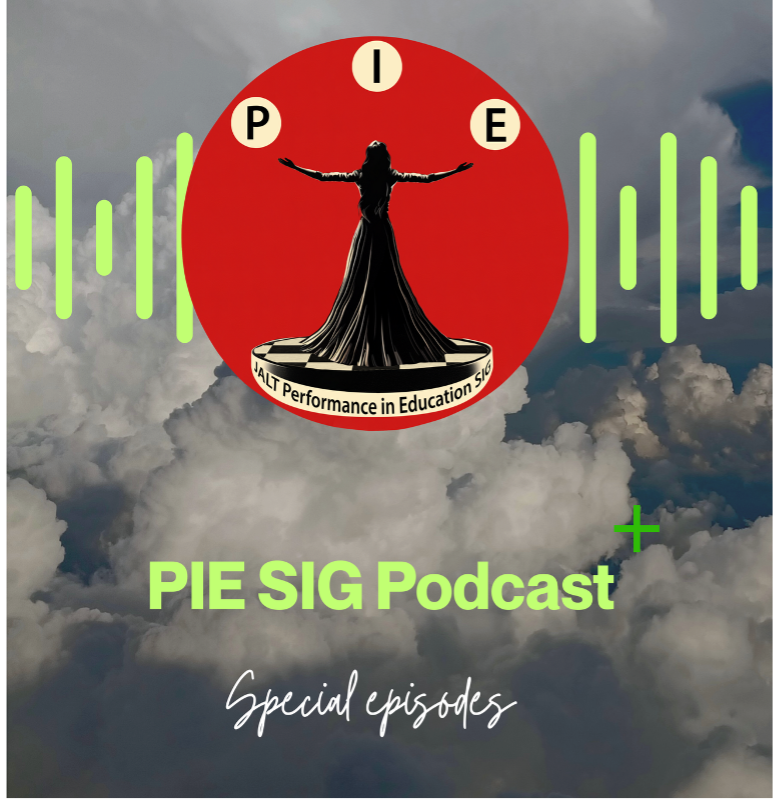

Did you know that there is a new PIE SIG Podcast?

**PIE SIG Podcast +** is the latest series from JALT’s Performance in Education SIG, designed to keep educators updated on what’s happening now in performance in education. Building on the success of our flagship PIE SIG Podcast, which already reaches listeners in over **16 countries**, this series features shorter, casual conversations with teachers, authors, students, and the people behind recent articles and upcoming events. 

Episode 1 features Dr. Thomas Robb, Professor Emeritus at Kyoto Sangyo University and Chair of the Extensive Reading Foundation. He discusses the upcoming **STEAM Conference in Naha, Okinawa (February 21–22, 2026)**, organized by David Kluge and JALT’s PIE SIG. With participation from numerous SIGs and sponsors, this conference highlights how the Arts can enrich STEM education and inspire creativity in the classroom.

Listen here:  
– Website: [https://jaltpiesig.org](https://jaltpiesig.org/)  
– Spotify: [https://open.spotify.com/show/6jifbXfPTr8hUll7WZv2Ve](https://open.spotify.com/show/6jifbXfPTr8hUll7WZv2Ve)  
– Or other major platforms
